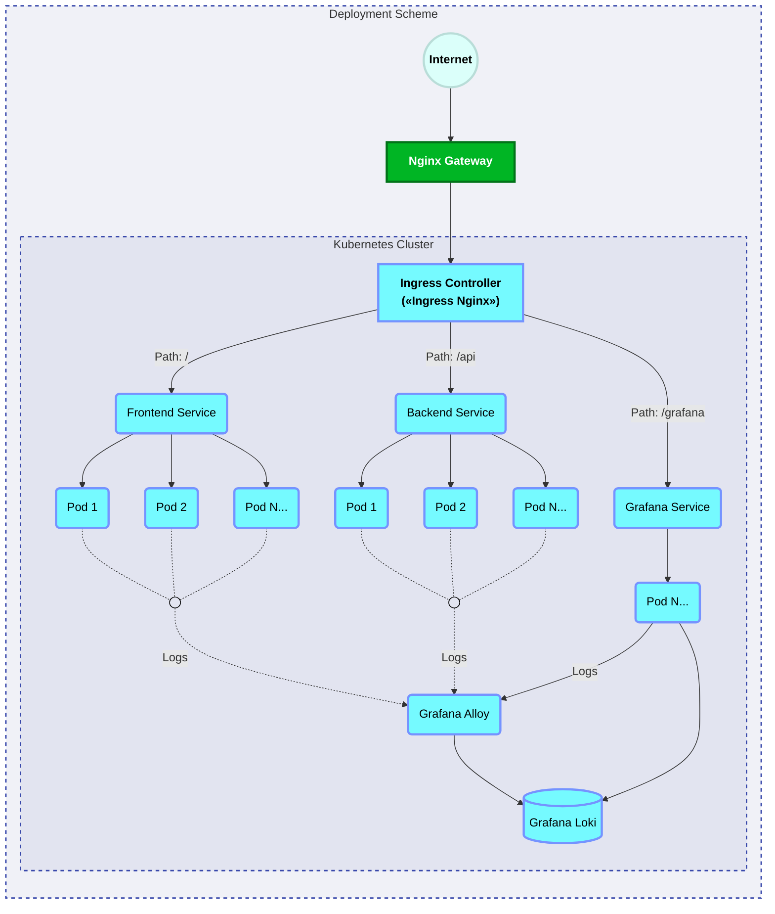

# RefreshTokenExperiment
Experiment with using JWT and Refresh Tokens. Frontend and Backend will be used. It will be deployed using Kubernetes.

## Planning

### Deployment Scheme

```mermaid
graph TB

subgraph all["Deployment Scheme"]
    direction TB
    www(("Internet"))
    nginx-out["Nginx Gateway"]

    subgraph k8s["Kubernetes Cluster"]
        direction TB
        ingress["Ingress Controller<br/>(«Ingress Nginx»)"]
        f-svc("Frontend Service")
        b-svc("Backend Service")
        g-svc("Grafana Service")
        fp1("Pod 1")
        fp2("Pod 2")
        fpN("Pod N...")
        bp1("Pod 1")
        bp2("Pod 2")
        bpN("Pod N...")
        gp("Pod N...")

        fps((" "))
        bps((" "))

        alloy("Grafana Alloy")
        loki[("Grafana Loki")]
    end
end

%% Connections
www --> nginx-out
nginx-out --> ingress
ingress -->|Path: /| f-svc
ingress -->|Path: /api| b-svc
ingress -->|Path: /grafana| g-svc

f-svc --> fp1
f-svc --> fp2
f-svc --> fpN

b-svc --> bp1
b-svc --> bp2
b-svc --> bpN

g-svc --> gp

fp1 & fp2 & fpN -.- fps
bp1 & bp2 & bpN -.- bps

fps & bps -.->|Logs| alloy
gp -->|Logs| alloy

alloy & gp --> loki

%% Stylization
class fps,bps invisible
class ingress,f-svc,fp1,fp2,fpN,b-svc,bp1,bp2,bpN,g-svc,gp,alloy,loki k8s
class www,ingress,f-svc,fp1,fp2,fpN,b-svc,bp1,bp2,bpN,g-svc,gp,alloy,loki black
class all,k8s sub

classDef invisible fill:#fff0,stroke:#000,color:#fff0
classDef k8s fill:#75faff,stroke:#7593ff,stroke-width:3px
classDef black color:#000

style nginx-out fill:#00b524,color:#fff,font-weight:bold,stroke:#027319,stroke-width:3px
style www fill:#dbfffa,font-weight:bold,stroke:#b9ddd8,stroke-width:3px
style ingress font-weight:bold

classDef sub fill:#1a237e10,stroke:#3949ab,stroke-width:2px,stroke-dasharray:5 5
```
